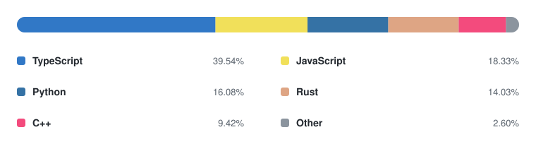
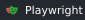

  

  
<strong>Computer Science student at The City College of New York</strong>

---

### About

I build stuff, mostly with TypeScript, Python, C++, and Rust.

### Connect

### Top Languages

  

Based on representative projects and contributions

### Web & Product Engineering

  
  
  
  
  

### Systems, Desktop & Media

  
  
  
  
  
  
  

### Backend & Data Infrastructure

  
  
  
  
  

### Developer Tooling & Automation

  
  
  
  
  

### Data & Machine Learning

  
  
  
  

### GitHub Activity

  

Last 12 months

